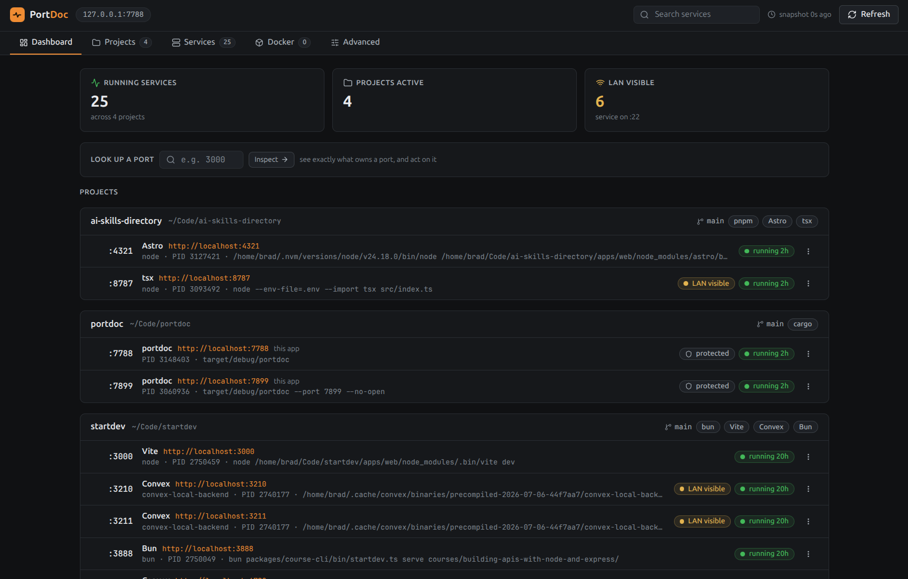

# PortDoc

A local dev server control panel. One binary serves a web dashboard showing
what dev apps are running, which project owns each port, what URL to open,
and what can be stopped safely.



- **Project-grouped dashboard** - services grouped by the repo that owns them,
  with framework labels (Next.js, Vite, Express, Redis, Postgres, and more),
  git branch, and package manager
- **Port lookup** - type a port, see exactly what owns it and act on it
- **Exposure labels** - know what is local-only, LAN-visible, or Docker-bound
- **Stale hints** - find the dev server you forgot about last week
- **Safe stop** - graceful stop with confirmation, force kill only behind a
  second explicit yes
- **Docker and Advanced tabs** - container hints, raw sockets, JSON export

Everything runs locally. No accounts, no telemetry.

## Install

**Linux / macOS**

```sh
curl --proto '=https' --tlsv1.2 -LsSf https://github.com/bradtraversy/portdoc/releases/latest/download/portdoc-installer.sh | sh
```

**Windows (PowerShell)**

```powershell
irm https://github.com/bradtraversy/portdoc/releases/latest/download/portdoc-installer.ps1 | iex
```

**Homebrew (macOS / Linux)**

```sh
brew install bradtraversy/tap/portdoc
```

Binaries and checksums for every platform are on the
[releases page](https://github.com/bradtraversy/portdoc/releases).

## Use

```sh
portdoc              # start the dashboard on 127.0.0.1:7788 and open it
portdoc --port 7799  # different port
portdoc --no-open    # don't open the browser
portdoc --json       # print the snapshot as JSON and exit
```

The server binds `127.0.0.1` only; nothing is reachable from the network.
`Ctrl+C` stops it.

## Known limitations (v0.1)

- **Windows**: the stop action returns "not supported on this platform" -
  process metadata for services owned by other users degrades gracefully to
  unknown, same as on Linux and macOS.
- macOS binaries are unsigned; the installer and Homebrew paths avoid
  Gatekeeper quarantine, but a manually downloaded binary may need
  `xattr -d com.apple.quarantine`.

## Build from source

Needs Rust (stable, MSVC toolchain on Windows) and Node.

```sh
git clone https://github.com/bradtraversy/portdoc.git
cd portdoc/web && npm ci && npm run build   # the binary embeds web/dist
cd .. && cargo run
```

## Development

- `src/` - Rust binary: clap CLI entry, axum server, platform probes
- `web/` - React + TypeScript + Vite frontend

```sh
cargo run            # server on 127.0.0.1:7788 (serves web/dist in debug too)
cargo test           # test suite
cargo clippy         # lint

cd web
npm run dev          # Vite dev server
npm run build        # production build to web/dist
npm run lint
```

Releases are built by [cargo-dist](https://github.com/axodotdev/cargo-dist):
push a `vX.Y.Z` tag matching the Cargo version and CI builds binaries for
Linux, macOS, and Windows, publishes them with checksums to GitHub Releases,
and updates the [Homebrew tap](https://github.com/bradtraversy/homebrew-tap).
